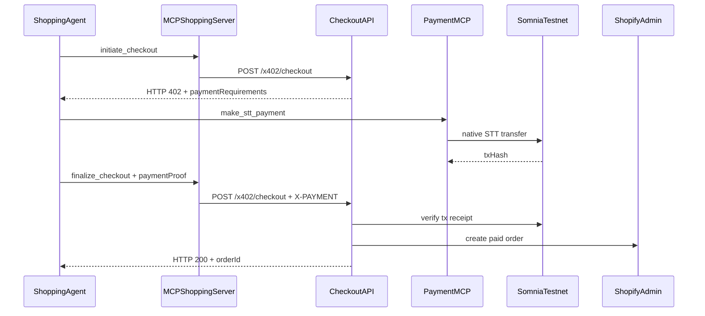
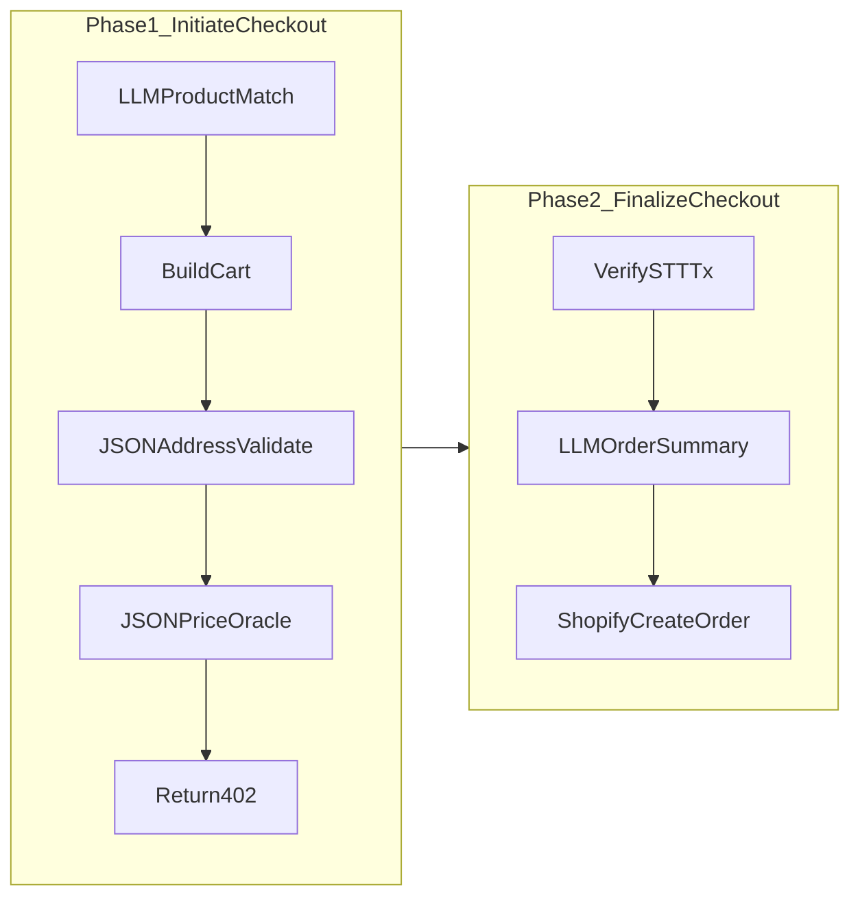

# Agent-Checkout: Somnia Migration Plan

## Executive summary

**Somnia does not document native x402 support.** Per [Somnia Agents docs](https://docs.somnia.network/agents), payments on Somnia use standard EVM `msg.value` in **STT** (testnet) / **SOMI** (mainnet). That is fine: the forked codebase already implements a **custom HTTP 402 layer** in [`packages/backend/src/x402-sdk/`](packages/backend/src/x402-sdk/) — we keep the 402 + MCP agent-commerce protocol and **swap only the settlement/verification layer** from Solana to Somnia EVM.

**Repo end state:** The `x402-shopify-commerce-main/` directory is a temporary import only. When migration is complete, the monorepo lives at the **repository root** (`packages/frontend`, `packages/backend`, root `README.md`) and `x402-shopify-commerce-main/` is **deleted**. No file, comment, README, or git history reference to that folder name should remain in the working tree (attribution to upstream x402/Shopify concepts is fine; the old folder/project name is not).

Your choices (native STT + deep Somnia Agents) align perfectly with what Somnia judges care about: consensus-validated off-chain compute, not just “another EVM chain swap.”

---

## Part 1: Cursor environment setup (do this first)

No `.cursor/` config exists yet. Create project-scoped guidance at the repo root (`d:\agent-checkout\`).

### 1.1 Rules (`.cursor/rules/`)

| File | Scope | Purpose |
|------|-------|---------|
| [`agent-checkout-core.mdc`](.cursor/rules/agent-checkout-core.mdc) | `alwaysApply: true` | Project identity, monorepo layout, naming (`agent-checkout`), hackathon goals, “minimize scope” principle |
| [`somnia-evm-payments.mdc`](.cursor/rules/somnia-evm-payments.mdc) | `packages/backend/**/*.ts` | Somnia network constants (chain ID **50312**, RPC `https://dream-rpc.somnia.network`), viem patterns, STT wei math, no Solana imports |
| [`mcp-x402-protocol.mdc`](.cursor/rules/mcp-x402-protocol.mdc) | `**/mcp-*.ts`, `**/x402-*.ts` | Preserve two-phase 402 checkout, MCP tool contracts, payment proof schema |

**Core rule content to encode:**
- Target network: **Somnia Shannon Testnet** (50312, STT)
- Payment scheme: `x402-somnia-stt-v1` (new; replaces `x402-solana-usdc-v1`)
- Never commit `.env`, Shopify tokens, or private keys
- Prefer extending existing files over new abstractions
- Never reference `x402-shopify-commerce-main` — project name is **agent-checkout** only

### 1.2 Skills (`.cursor/skills/`)

| Skill | Trigger | Contents |
|-------|---------|----------|
| [`somnia-agents/SKILL.md`](.cursor/skills/somnia-agents/SKILL.md) | Somnia Agents, JSON API, LLM, agent invocation | Chain IDs, RPC URLs, agent HTTP POST invocation pattern, ABI encoding, gas/deposit sizing, link to `docs.somnia.network/agents/readme.md?ask=<question>` |
| [`agent-checkout-demo/SKILL.md`](.cursor/skills/agent-checkout-demo/SKILL.md) | Demo, pitch, hackathon submission | 3-minute demo script, judge talking points, env checklist, ngrok setup |

Keep each SKILL.md under ~150 lines; put contract addresses/RPC tables in `reference.md`.

### 1.3 Subagents (`.cursor/agents/`)

| Agent | When to delegate |
|-------|------------------|
| [`somnia-integration.md`](.cursor/agents/somnia-integration.md) | viem wallet code, STT transfers, tx verification, Somnia RPC issues |
| [`somnia-agents-builder.md`](.cursor/agents/somnia-agents-builder.md) | JSON API / LLM agent calls, ABI encode/decode, agent receipt debugging |
| [`checkout-flow-reviewer.md`](.cursor/agents/checkout-flow-reviewer.md) | After changes to checkout, MCP tools, or payment verification |
| [`hackathon-demo-coach.md`](.cursor/agents/hackathon-demo-coach.md) | README, demo video script, submission copy |

Example subagent description pattern:
> “Somnia EVM payment specialist. Use proactively when modifying x402-sdk, payment-service, or mcp-payment-handler. Knows chain 50312, viem, native STT transfers.”

---

## Part 2: x402 on Somnia — technical strategy

### What we keep (unchanged conceptually)



### What we replace

| Solana (current) | Somnia (target) |
|------------------|-----------------|
| `@solana/web3.js`, `@solana/spl-token` | `viem` (wallet client, public client, tx verification) |
| USDC SPL transfer | **Native STT** transfer (`value` in wei) |
| `signature` in payment proof | `txHash` + `chainId: 50312` |
| `solana-devnet` store metadata | `somnia-testnet` |
| `solana-utils.ts` | New `evm-utils.ts` (or `somnia-utils.ts`) |

### Why not `@x402/evm` package?

Official [`@x402/evm`](https://www.npmjs.com/package/@x402/evm) uses **EIP-3009 USDC** — Somnia’s documented payment path is **native coin**, not EIP-3009 stablecoins. Using `@x402/evm` would likely fail on testnet without USDC infrastructure. Our custom 402 layer (already in-repo) is the right fit; we only rename schemes and swap verification.

### STT amount conversion (demo-friendly)

Cart totals are USD from Shopify. For hackathon demo:

1. **Primary:** Somnia **JSON API Request** agent fetches STT/USD from a public API (e.g. CoinGecko) — consensus-validated oracle, great demo moment
2. **Fallback:** Fixed demo rate in env (`STT_USD_RATE=0.01`) if agent call fails

```typescript
// Conceptual: packages/backend/src/utils/stt-pricing.ts
sttWei = usdToSttWei(usdAmount, sttUsdRate)
```

---

## Part 3: Somnia Agents — deep integration (your differentiator)

This is what separates “chain swap” from “Somnia Agentathon winner.”

### Agent touchpoints in checkout flow



| Step | Somnia Agent | Purpose |
|------|--------------|---------|
| Natural-language shopping | **LLM Inference** | “Find me a blue hoodie under $50” → structured product IDs |
| Address validation | **JSON API Request** | Call geocoding/validation API; reject invalid shipping before 402 |
| STT/USD rate | **JSON API Request** | Consensus-validated price feed for STT conversion |
| Post-payment confirmation | **LLM Inference** | Human-readable order summary for agent/user logs |
| Optional stretch | **Reactivity** | On-chain event listener auto-triggers webhook/agent on payment |

### New backend module

Create [`packages/backend/src/somnia-agents/`](packages/backend/src/somnia-agents/):
- `client.ts` — HTTP POST agent invocation (ABI encode/decode per [Somnia Agents quickstart](https://docs.somnia.network/agents/invoking-agents/quickstart.md))
- `json-api.ts`, `llm.ts` — typed wrappers for base agents
- `config.ts` — agent endpoints, deposits, network (50312)

Wire into:
- [`mcp-handler.ts`](packages/backend/src/api/mcp-handler.ts) — new tools: `search_products_nl`, `validate_shipping`
- [`x402-checkout.ts`](packages/backend/src/api/x402-checkout.ts) — call agents in Phase 1 validation + pricing

---

## Part 4: Code migration phases

### Phase 0 — Hoist to repo root (early, not at the end)

Move contents of `x402-shopify-commerce-main/` up to `d:\agent-checkout\` immediately so all work happens at the correct paths:

```
agent-checkout/                  # repo root (this folder)
├── packages/
│   ├── frontend/
│   └── backend/
├── package.json
├── pnpm-workspace.yaml
├── README.md
└── .cursor/
```

- Update root [`package.json`](package.json) name to `agent-checkout`
- Replace all UI copy: **Agent Checkout** (not "x402 Shopify Commerce")
- Add [`.env.example`](packages/backend/.env.example) with Somnia vars
- Keep `x402-*` **API route prefixes** internally if useful (HTTP 402 is the protocol), but remove **Solana/USDC** and **old project name** from user-facing strings

**New env vars:**
```bash
SOMNIA_NETWORK=testnet          # testnet | mainnet
SOMNIA_RPC_URL=https://dream-rpc.somnia.network
SOMNIA_CHAIN_ID=50312
EVM_PRIVATE_KEY=0x...           # agent payer (replaces WALLET_SECRET_KEY)
X402_RECIPIENT_ADDRESS=0x...    # merchant STT recipient
STT_USD_RATE=                   # optional fallback
SOMNIA_AGENT_RPC=               # agent invocation endpoint from quickstart
```

### Phase 1 — EVM payment SDK

Refactor [`packages/backend/src/x402-sdk/`](packages/backend/src/x402-sdk/):

1. Add `evm-utils.ts`: create STT transfer tx, sign/send, verify receipt (to, value, success)
2. Update [`x402-types.ts`](packages/backend/src/x402-sdk/x402-types.ts): networks `somnia-testnet` / `somnia-mainnet`, proof shape `{ txHash, chainId, timestamp }`
3. Update [`server.ts`](packages/backend/src/x402-sdk/server.ts) verification to use EVM
4. **Delete** `solana-utils.ts` and remove `@solana/*` from [`package.json`](packages/backend/package.json); add `viem`

### Phase 2 — Payment MCP

Refactor [`mcp-payment-handler.ts`](packages/backend/src/api/mcp-payment-handler.ts):
- Rename tool: `make_usdc_payment` → `make_stt_payment`
- Accept `amountWei` (string) instead of `amountMicroUsdc`
- Return `{ txHash, chainId, timestamp }` payment proof

### Phase 3 — Checkout & helpers

Update:
- [`x402-payment-helpers.ts`](packages/backend/src/utils/x402-payment-helpers.ts) — scheme `x402-somnia-stt-v1`, STT wei amounts
- [`x402-config.ts`](packages/backend/src/utils/x402-config.ts) — viem public/wallet clients
- [`x402-checkout.ts`](packages/backend/src/api/x402-checkout.ts) — EVM verification path
- [`create-store.ts`](packages/backend/src/api/create-store.ts) + frontend — `networks: ["somnia-testnet"]`

Fix existing inconsistency: unify network strings everywhere (remove all `solana-devnet` / `solana-mainnet` references).

### Phase 4 — Somnia Agents layer

Implement `somnia-agents/` module and integrate per Part 3.

### Phase 5 — Frontend & merchant UX

- Rebrand to **Agent Checkout**
- Dashboard: show `txHash` with [Shannon explorer](https://shannon-explorer.somnia.network/) links
- Products page: show “Agent-enabled on Somnia Testnet”
- Optional: MetaMask “Add Somnia Testnet” button for merchants

### Phase 6 — Demo & submission polish

- End-to-end demo: Cursor agent → MCP → 402 → STT pay → Shopify order
- Record 3–5 min video showing **Somnia Agent** calls (oracle + NL search)
- README sections: Architecture diagram, Somnia Agents usage, testnet faucet links
- Deploy frontend (Vercel) + backend (Railway/Render) with ngrok fallback

### Phase 7 — Final repo cleanup (required before submission)

This is a **hard gate** — do not consider the project done until passed.

1. **Delete** the entire `x402-shopify-commerce-main/` directory (should be empty/unused after Phase 0 hoist; if anything remains, remove it)
2. **Grep the repo** for forbidden strings and fix or remove every hit:
   - `x402-shopify-commerce-main`
   - `x402-shopify-commerce`
   - `x402 Shopify Commerce`
   - `Solana` / `solana-devnet` / `USDC` (unless in historical/changelog context — prefer removing entirely)
   - `@solana/web3.js`, `WALLET_SECRET_KEY` (base58 Solana key)
3. **Verify package names**: root and workspace packages use `agent-checkout` naming
4. **Verify MCP server names**: e.g. `agent-checkout-shopping-agent`, not `x402-shopping-agent`
5. **Verify README** describes Agent Checkout on Somnia only; optional one-line "Built on HTTP 402 + MCP" is fine
6. **Run** `pnpm install && pnpm build && pnpm type-check` from repo root with no nested folder
7. **Git status** should show a flat monorepo — no orphaned nested project directory

```bash
# Acceptance check (run from repo root)
rg -i "x402-shopify-commerce|solana-devnet|@solana" --glob '!node_modules' .
# Expected: zero matches (x402 protocol references in API paths like /x402/checkout are OK)
```

---

## Part 5: Winning the hackathon + Somnia hiring signal

Encode hackathons typically score on **Technical Accomplishment, Novelty, Impact, Design, Creativity** ([Encode submission guide](https://www.blog.encode.club/nft-hack-submission-guide-c43a16d246c6)). Somnia’s own [AI Hackathon](https://dorahacks.io/hackathon/somnia-ai-hackathon/report) rewarded **on-chain autonomous agents** with real testnet deployments.

### Pitch narrative (one sentence)

> **Agent Checkout** is the first agent-native Shopify checkout where AI agents discover products via MCP, pay with HTTP 402 + native STT on Somnia, and use **consensus-validated Somnia Agents** for pricing, validation, and natural-language commerce.

### Judge checklist

| Criterion | How we hit it |
|-----------|---------------|
| **Novelty** | HTTP 402 agent commerce + Somnia Agents (not just wallet swap) |
| **Technical** | Full MCP two-phase checkout, on-chain verification, agent ABI integration |
| **Impact** | Any Shopify merchant → agent-ready in 2 minutes (existing UX preserved) |
| **Design** | Merchant UI unchanged simplicity; agent API documented |
| **Somnia-specific** | JSON API oracle, LLM product search, deterministic agent receipts |

### Somnia hiring signals

- Open-source repo with clean migration PR history
- Tweet/tag `@emreyeth` in Discord `#dev-chat` with demo link + GitHub
- Blog post: “Building agent commerce with Somnia Agents + HTTP 402”
- Show you read prototype docs and handle agent deposit/gas correctly

---

## Part 6: Risk register

| Risk | Mitigation |
|------|------------|
| Somnia Agents API changes (prototype) | Pin addresses from quickstart; isolate in `somnia-agents/` |
| No USDC on Somnia | **Resolved** — native STT (your choice) |
| STT/USD volatility in demo | Agent oracle + env fallback rate |
| `@x402/evm` incompatible | Don't use it; keep custom 402 layer |
| Agent invocation cost | Size deposits per [gas fees docs](https://docs.somnia.network/agents/invoking-agents/gas-fees.md); cache price for 60s |

---

## Suggested implementation order

1. **Cursor setup** (rules, skills, subagents) — 1 session
2. **Hoist monorepo to repo root** — delete nested folder path from day-to-day work
3. **EVM payment SDK + payment MCP** — unblock end-to-end STT checkout
4. **Checkout wiring + frontend rebrand** — working demo without agents
5. **Somnia Agents integration** — differentiation layer
6. **Demo video + README + deployment** — submission
7. **Final cleanup gate** — grep audit, delete `x402-shopify-commerce-main/`, confirm zero legacy references

---

## Key files to modify (reference)

All paths relative to **repo root** after Phase 0 hoist:

| Area | Files |
|------|-------|
| Payment core | `solana-utils.ts` → `evm-utils.ts`, [`server.ts`](packages/backend/src/x402-sdk/server.ts), [`client.ts`](packages/backend/src/x402-sdk/client.ts) |
| Checkout | [`x402-checkout.ts`](packages/backend/src/api/x402-checkout.ts), [`x402-payment-helpers.ts`](packages/backend/src/utils/x402-payment-helpers.ts) |
| MCP | [`mcp-handler.ts`](packages/backend/src/api/mcp-handler.ts), [`mcp-payment-handler.ts`](packages/backend/src/api/mcp-payment-handler.ts) |
| Config | [`x402-config.ts`](packages/backend/src/utils/x402-config.ts), backend `package.json` |
| Frontend | [`page.tsx`](packages/frontend/app/page.tsx), [`dashboard/page.tsx`](packages/frontend/app/dashboard/page.tsx), [`products/page.tsx`](packages/frontend/app/products/page.tsx) |
| New | `packages/backend/src/somnia-agents/*`, `.cursor/rules/*`, `.cursor/skills/*`, `.cursor/agents/*` |
| Remove | Entire `x402-shopify-commerce-main/` directory + all Solana deps and branding
