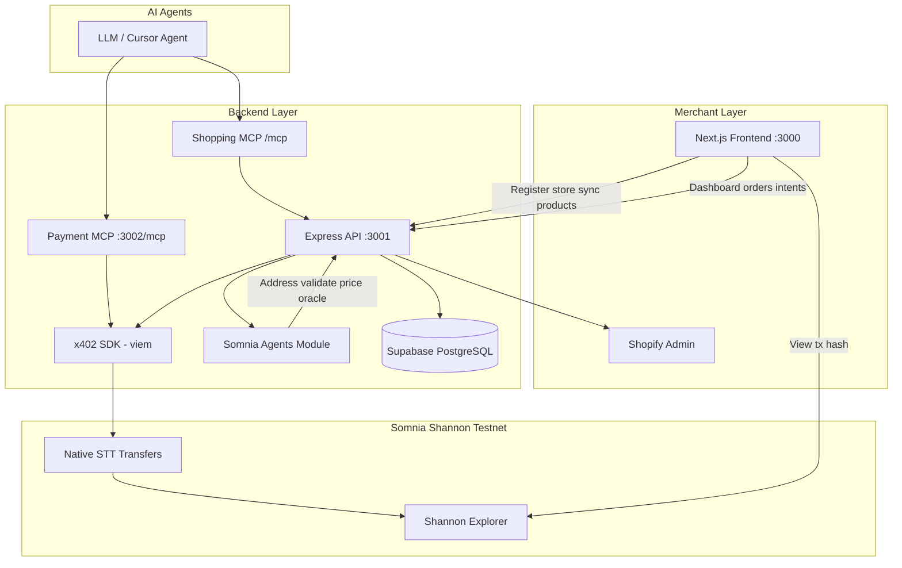
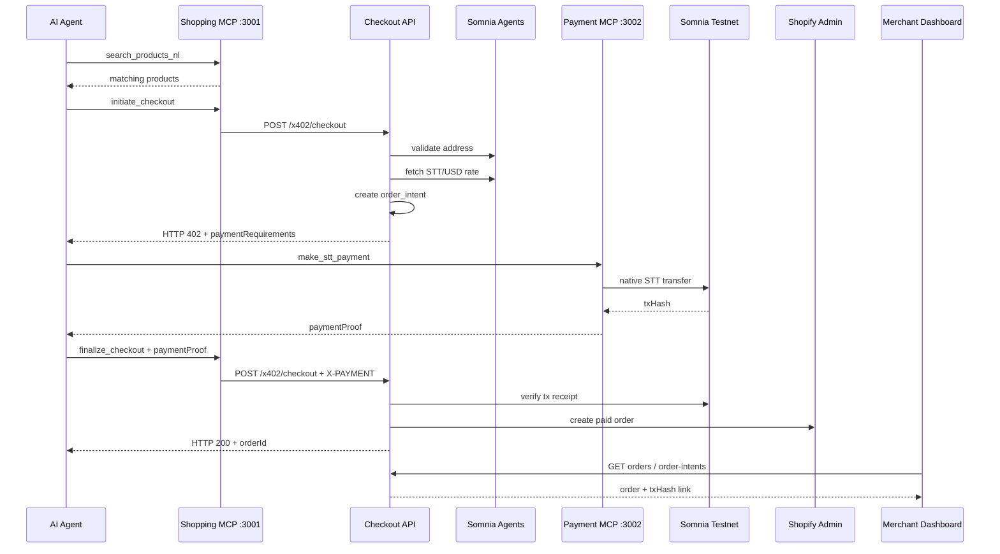
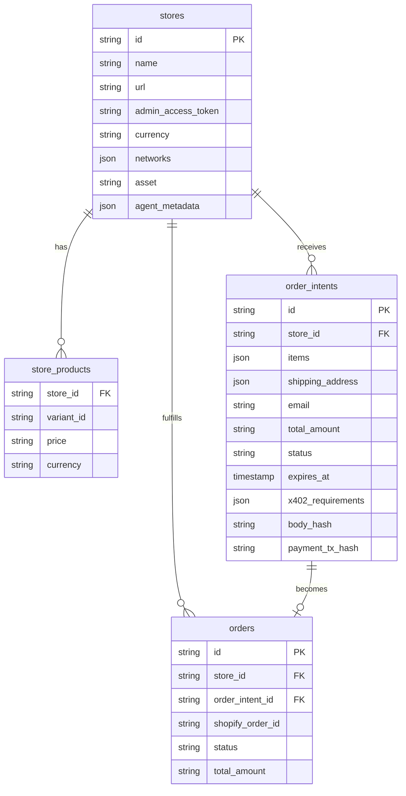

# Agent Checkout

**Agent-native Shopify commerce on Somnia** — AI agents discover products via MCP, pay with [HTTP 402](https://x402.org) + native **STT**, and use **Somnia Agents** for pricing, validation, and natural-language shopping.

Built for the [Encode Agentathon](https://www.encodeclub.com/programmes/agentathon).

---

## Feature parity with the original template

All capabilities from the upstream Shopify agent-commerce template are preserved in this repo, migrated from Solana/USDC to **Somnia STT**, with additional Somnia-specific features:

| Feature | Original | Agent Checkout |
|---------|----------|----------------|
| Merchant onboarding (register store) | Yes | Yes |
| Product selection & sync from Shopify | Yes | Yes |
| Orders & payment intents dashboard | Yes | Yes (+ Shannon explorer tx links) |
| Two-phase HTTP 402 checkout | Yes | Yes (`x402-somnia-stt-v1`) |
| MCP shopping server (port 3001) | Yes | Yes (+ 2 new tools) |
| MCP payment server (port 3002) | Yes | Yes (`make_stt_payment`) |
| On-chain payment verification | Solana USDC | Somnia native STT |
| Shopify paid order creation | Yes | Yes |
| Body-hash anti-tampering | Yes | Yes |
| 15-minute order intent expiry | Yes | Yes |
| Supabase persistence | Yes | Yes |
| Natural-language product search | — | **New** (`search_products_nl`) |
| Address validation before checkout | — | **New** (`validate_shipping`) |
| STT/USD price oracle | — | **New** (CoinGecko + env fallback) |

The legacy `x402-shopify-commerce-main/` folder has been **removed** — this repo is the single source of truth.

---

## Problem & solution

**Problem:** Shopify stores are built for humans. AI agents need a standard protocol to discover products, initiate checkout, and pay programmatically — without custom integrations per store.

**Solution:** A **2-minute merchant setup** that exposes any Shopify store to agents via MCP, settles payments on Somnia with HTTP 402, and syncs confirmed orders back to Shopify admin.

---

## System architecture



---

## Checkout sequence (HTTP 402)



---

## Project structure

```
agent-checkout/
├── packages/
│   ├── frontend/                 # Next.js merchant UI
│   │   ├── app/
│   │   │   ├── page.tsx          # Landing
│   │   │   ├── register/         # Connect Shopify store
│   │   │   ├── products/         # Select & sync products
│   │   │   └── dashboard/        # Orders + payment intents
│   │   └── components/ui/        # shadcn-style components
│   │
│   └── backend/                  # Express API + MCP servers
│       ├── src/
│       │   ├── index.ts          # Main server :3001
│       │   ├── payment-service.ts # Payment MCP :3002
│       │   ├── api/
│       │   │   ├── x402-checkout.ts      # Two-phase checkout
│       │   │   ├── mcp-handler.ts        # Shopping MCP tools
│       │   │   ├── mcp-payment-handler.ts # STT payment tool
│       │   │   ├── create-store.ts
│       │   │   └── shopify-products.ts
│       │   ├── x402-sdk/         # HTTP 402 + viem verification
│       │   ├── somnia-agents/    # Oracle, validation, NL search
│       │   └── utils/
│       └── .env.example
│
├── .cursor/                      # Rules, skills, subagents
├── README.md
└── SUBMISSION.md                 # Hackathon submission guide
```

---

## Quick start

### Prerequisites

| Requirement | Purpose |
|-------------|---------|
| Node.js 18+, pnpm | Runtime & monorepo |
| Shopify store + Admin API token | Product catalog & order creation |
| Supabase project | Stores, products, orders, intents |
| EVM wallet with STT | Agent payer + merchant recipient |
| [STT faucet](https://testnet.somnia.network/) | Testnet tokens |

### 1. Install dependencies

```bash
pnpm install
```

### 2. Configure backend

```bash
cp packages/backend/.env.example packages/backend/.env
```

Required variables:

```bash
# Supabase
SUPABASE_URL=https://your-project.supabase.co
SUPABASE_KEY=your-service-role-key

# Somnia Shannon Testnet
SOMNIA_NETWORK=testnet
SOMNIA_RPC_URL=https://dream-rpc.somnia.network
SOMNIA_CHAIN_ID=50312

# Wallets (hex private key + recipient address)
EVM_PRIVATE_KEY=0x...
X402_RECIPIENT_ADDRESS=0x...

# Optional: STT/USD fallback when oracle unavailable
STT_USD_RATE=0.01

# Server URLs
PORT=3001
PAYMENT_SERVER_PORT=3002
FRONTEND_URL=http://localhost:3000
BACKEND_URL=http://localhost:3001
```

### 3. Run services

**Option A — everything from root:**

```bash
pnpm dev
```

**Option B — separately:**

```bash
# Terminal 1: backend + payment MCP
cd packages/backend && pnpm dev:all

# Terminal 2: frontend
cd packages/frontend && pnpm dev
```

| Service | URL |
|---------|-----|
| Frontend | http://localhost:3000 |
| API + Shopping MCP | http://localhost:3001 |
| Payment MCP | http://localhost:3002/mcp |
| Health checks | `/health` on each server |

### 4. Merchant flow

1. **`/register`** — Paste Shopify URL + Admin API token → store registered
2. **`/products`** — Select variants → sync to platform
3. **`/dashboard`** — Monitor agent orders and payment intents (with explorer links)

### 5. Expose for remote agents (ngrok)

```bash
ngrok http 3001   # Shopping MCP
ngrok http 3002   # Payment MCP
```

Point your agent client at `https://<id>.ngrok.io/mcp` for each server.

---

## MCP tools reference

### Shopping agent (`POST http://localhost:3001/mcp`)

JSON-RPC 2.0 — methods: `initialize`, `tools/list`, `tools/call`

| Tool | Phase | Description |
|------|-------|-------------|
| `list_stores` | Discovery | All agent-enabled stores |
| `get_store_products` | Discovery | Product catalog for a store |
| `search_products_nl` | Discovery | Natural-language product search |
| `validate_shipping` | Pre-checkout | Validate shipping address |
| `initiate_checkout` | Phase 1 | Create order intent → HTTP 402 |
| `finalize_checkout` | Phase 2 | Submit payment proof → Shopify order |
| `get_order_details` | Post-sale | Lookup order by ID |

### Payment agent (`POST http://localhost:3002/mcp`)

| Tool | Description |
|------|-------------|
| `make_stt_payment` | Send native STT; returns `{ txHash, chainId, network, timestamp }` |

---

## REST API reference

### Merchant APIs

| Method | Endpoint | Description |
|--------|----------|-------------|
| `POST` | `/api/stores` | Register Shopify store |
| `POST` | `/api/stores/:storeId/products` | Sync selected products |
| `POST` | `/api/shopify/products` | Fetch products from Shopify |

### Agent APIs

| Method | Endpoint | Description |
|--------|----------|-------------|
| `GET` | `/x402/stores` | List stores |
| `GET` | `/x402/stores/:storeId/products` | Store product catalog |
| `GET` | `/x402/stores/:storeId/orders` | Confirmed orders |
| `GET` | `/x402/stores/:storeId/order-intents` | Pending payment intents |
| `POST` | `/x402/checkout` | Two-phase checkout (see below) |
| `GET` | `/x402/orders/:orderId` | Single order details |

### Checkout API (`POST /x402/checkout`)

**Phase 1** — no `X-PAYMENT` header:

```json
{
  "storeId": "store_abc123",
  "items": [{ "productId": "variant_123", "quantity": 1 }],
  "email": "buyer@example.com",
  "shippingAddress": {
    "name": "Jane Doe",
    "address1": "123 Main St",
    "city": "San Francisco",
    "state": "CA",
    "postalCode": "94102",
    "country": "US"
  }
}
```

**Response (402):**

```json
{
  "orderIntentId": "oi_abc12345",
  "amounts": {
    "subtotal": "25.00",
    "shipping": "5.00",
    "tax": "0.00",
    "total": "30.00",
    "currency": "USD"
  },
  "paymentRequirements": [{
    "scheme": "x402-somnia-stt-v1",
    "network": "somnia-testnet",
    "chainId": 50312,
    "asset": "STT",
    "amount": "3000000000000000000000",
    "payTo": "0xRecipientAddress...",
    "expiresAt": "2026-05-28T13:00:00.000Z"
  }]
}
```

**Phase 2** — same body + `orderIntentId` + header:

```
X-PAYMENT: {"txHash":"0x...","network":"somnia-testnet","chainId":50312,"timestamp":1716892800000}
```

**Response (200):**

```json
{
  "orderId": "ord_abc12345",
  "orderIntentId": "oi_abc12345",
  "status": "confirmed",
  "shopifyOrderId": "5678901234",
  "payment": { "verified": true, "txHash": "0x..." }
}
```

---

## Payment scheme

| Field | Value |
|-------|-------|
| Scheme | `x402-somnia-stt-v1` |
| Settlement | Native STT via `msg.value` (18 decimals) |
| Proof | `{ txHash, chainId, network, timestamp }` |
| USD → STT | Somnia Agents oracle (CoinGecko) + `STT_USD_RATE` fallback |
| Verification | viem receipt check (recipient, value, success) |

We use a **custom HTTP 402 layer** (not `@x402/evm`) because Somnia settles in native coin, not EIP-3009 USDC.

---

## Somnia network

| | Shannon Testnet | Mainnet |
|---|-----------------|---------|
| Chain ID | **50312** | **5031** |
| Symbol | STT | SOMI |
| RPC | https://dream-rpc.somnia.network | https://api.infra.mainnet.somnia.network |
| Explorer | https://shannon-explorer.somnia.network/ | https://explorer.somnia.network/ |
| Faucet | https://testnet.somnia.network/ | — |

Add Shannon Testnet to MetaMask: Chain ID `50312`, RPC above, symbol `STT`.

---

## Database schema (Supabase)



---

## Security

| Control | Implementation |
|---------|----------------|
| On-chain verification | viem receipt validation before Shopify order |
| Cart tampering prevention | SHA-256 body hash on order intent |
| Intent expiry | 15-minute window |
| Secrets isolation | All keys in backend `.env` only |
| Address validation | Geocoding check before Phase 1 402 |

---

## Technology stack

| Layer | Technologies |
|-------|-------------|
| Frontend | Next.js 16, React 19, Tailwind CSS 4, Radix UI |
| Backend | Express 4, TypeScript, Zod |
| Database | Supabase (PostgreSQL) |
| Blockchain | Somnia EVM, viem, native STT |
| Agent protocol | MCP (JSON-RPC 2.0), HTTP 402 |
| Commerce | Shopify Admin REST API |

---

## Demo script (3 minutes)

| Step | Action | What to show |
|------|--------|--------------|
| 1 | Open `/register` | Merchant connects Shopify in 30s |
| 2 | Open `/products` | Select products, sync |
| 3 | Agent: `search_products_nl` | "blue hoodie under $50" |
| 4 | Agent: `initiate_checkout` | HTTP 402 + STT wei amount |
| 5 | Agent: `make_stt_payment` | Tx on Shannon explorer |
| 6 | Agent: `finalize_checkout` | Order confirmed |
| 7 | Open `/dashboard` | Order + tx hash link |

See [SUBMISSION.md](SUBMISSION.md) for hackathon judging notes.

---

## Troubleshooting

| Issue | Fix |
|-------|-----|
| Frontend can't reach backend | Ensure API on `:3001`; check CORS / `FRONTEND_URL` |
| Products won't load | Verify Shopify Admin API token + product permissions |
| Payment verification fails | Confirm tx succeeded on [Shannon explorer](https://shannon-explorer.somnia.network/); check `amount` wei matches requirements |
| Insufficient STT | Fund agent wallet via [faucet](https://testnet.somnia.network/) |
| Order missing in Shopify | Check backend logs; verify `admin_access_token` on store row |
| STT amount seems wrong | Set `STT_USD_RATE` or check oracle logs |

---

## Development

```bash
pnpm type-check    # TypeScript across packages
pnpm build         # Build all packages
pnpm lint          # Lint all packages
```

Backend-only:

```bash
cd packages/backend
pnpm dev:all       # API :3001 + Payment MCP :3002
pnpm build         # Compile to dist/
```

---

## Hackathon pitch

> **Agent Checkout** is agent-native Shopify commerce where AI agents discover products via MCP, pay with HTTP 402 + native STT on Somnia, and use consensus-validated Somnia Agents for pricing, validation, and natural-language shopping.

---

## Links

- [Somnia Network](https://somnia.network/)
- [Somnia Agents](https://docs.somnia.network/agents)
- [Somnia Docs](https://docs.somnia.network/)
- [Encode Agentathon](https://www.encodeclub.com/programmes/agentathon)
- [HTTP 402 / x402](https://x402.org)
- [Model Context Protocol](https://modelcontextprotocol.io)

## License

MIT
